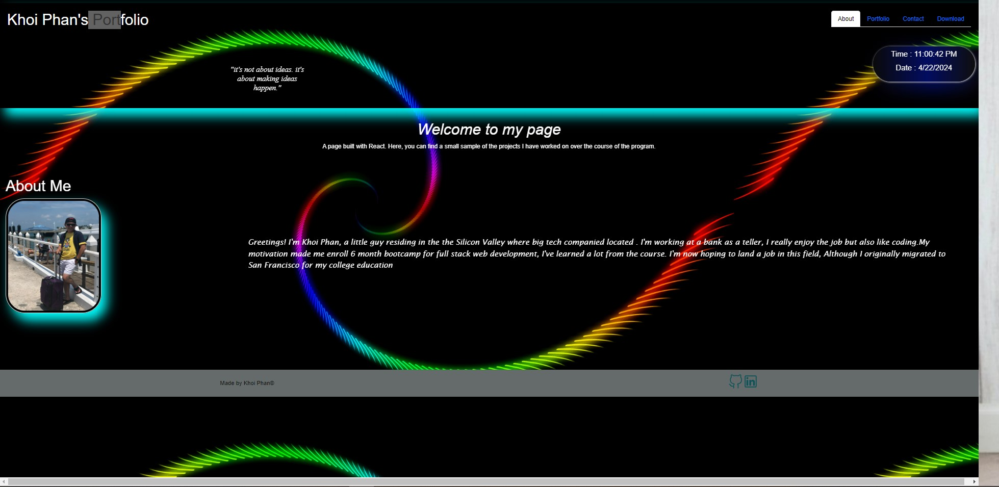
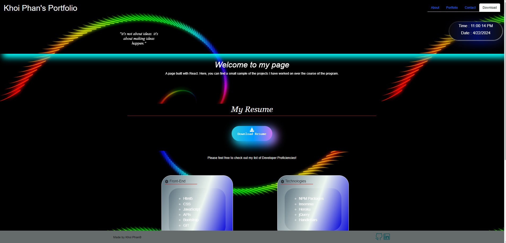
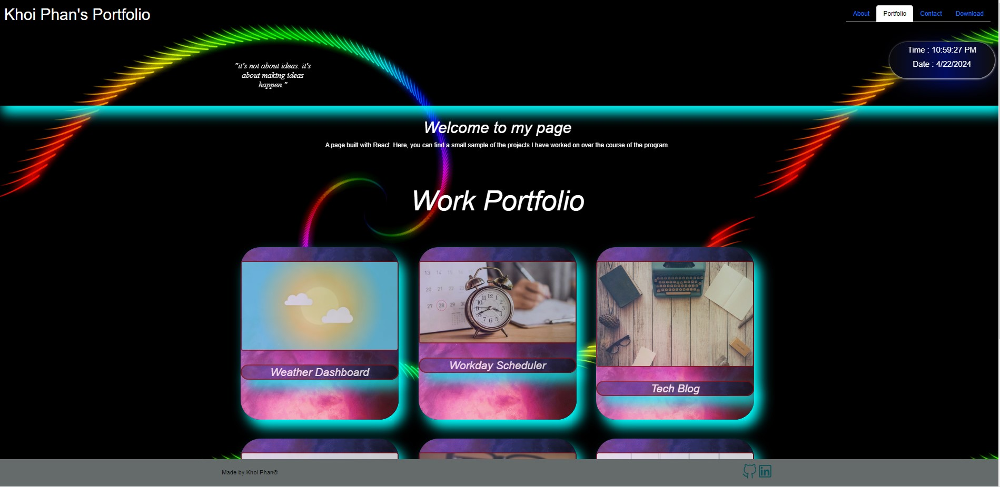

# React-Portfolio
react front end, js
[https://react-kpportfolio.onrender.com/](https://react-portfolio-5i0w.onrender.com/)

  
  
 ## Table of Contents:  
[1.Description](#Description)  
<br />
[2.Acceptance Criteria](#Acceptance-Criteria)
<br />
[3.Walkthrough Videos](#Walkthrough-Videos)
<br />
[4.Technology](#Technology)
<br />
[5.Screenshots](#screenshots)
<br />
[6.License](#License)  
<br/>
[7.Submission](#Submission)
<br />
[8.Questions](#Questions)  
<br />
## User Story

```md
AS A social media startup
I WANT an API for my social network that uses a NoSQL database
SO THAT my website can handle large amounts of unstructured data
```

## Description:
This portfolio application was developed and designed to showcase my web applications, resume, and skills to potential employers, clients, and interested parties. It was created using React an open sourced JavaScript library for building user interfaces. React was created by Facebook developers and helps simplify the process of building interactive and dynamic user interfaces by providing a component-based structure, efficient rendering through the virtual DOM, and a declarative syntax. It operates via a one page application, but gives the user experience of multiple page functionality.
As it stands, this application is all front-end. However I will be looking to add a backend framework so that I can receive messages via my contact page. React allows for developer flexibility and seems to still be on the rise in popularity. React offers developers numerous options in choosing other back-end frameworks and middleware options as it is a library focused on the View layer only therefore allowing developers to build UI components leaving the choice of other libraries or tools for additional functionalities open ended.


## Acceptance Criteria

```md
GIVEN a single-page application portfolio for a web developer
WHEN I load the portfolio
THEN I am presented with a page containing a header, a section for content, and a footer
WHEN I view the header
THEN I am presented with the developer's name and navigation with titles corresponding to different sections of the portfolio
WHEN I view the navigation titles
THEN I am presented with the titles About Me, Portfolio, Contact, and Resume, and the title corresponding to the current section is highlighted
WHEN I click on a navigation title
THEN the browser URL changes and I am presented with the corresponding section below the navigation and that title is highlighted
WHEN I load the portfolio the first time
THEN the About Me title and section are selected by default
WHEN I am presented with the About Me section
THEN I see a recent photo or avatar of the developer and a short bio about them
WHEN I am presented with the Portfolio section
THEN I see titled images of six of the developer’s applications with links to both the deployed applications and the corresponding GitHub repositories
WHEN I am presented with the Contact section
THEN I see a contact form with fields for a name, an email address, and a message
WHEN I move my cursor out of one of the form fields without entering text
THEN I receive a notification that this field is required
WHEN I enter text into the email address field
THEN I receive a notification if I have entered an invalid email address
WHEN I am presented with the Resume section
THEN I see a link to a downloadable resume and a list of the developer’s proficiencies
WHEN I view the footer
THEN I am presented with text or icon links to the developer’s GitHub and LinkedIn profiles, and their profile on a third platform (Stack Overflow, Twitter)
```

## Walkthrough Video


[![Youtube-Walk-Through Video React Portfolio]](https://www.youtube.com/watch?v=ii5p-t912ys)


## Screenshots








## Technology:
```md
- Project is created with:

    - Javascript
    - Node.js
    - React
    - DOM
    - Render Deployment
```

## Installation:


To make changes to the code base, clone the repo ([repo](https://github.com/khoiphan-9194/React-Portfolio/)).
 Run the following at the command line
```
    - npm install
    - npm run start
    
```

Users can also feel free to access the live application directly by visiting the render link ([Khoi Phan Portfolio](https://react-kpportfolio.onrender.com/)).

## Submission:
 [KhoiPhan-Github repository](https://github.com/khoiphan-9194//React-Portfolio)

## License
[](https://opensource.org/licenses/MIT)

SVG Logo Maker © is licensed under the ISC license.  

For more information regarding the SVG Logo Maker's license, please visit: 
https://opensource.org/licenses/MIT

  
## Questions?
  
### Github:[khoiphan-9194](https://github.com/khoiphan-9194)
  
### Reach Me Via Email: phanminhkhoi91@gmail.com

Thanks for viewing!


